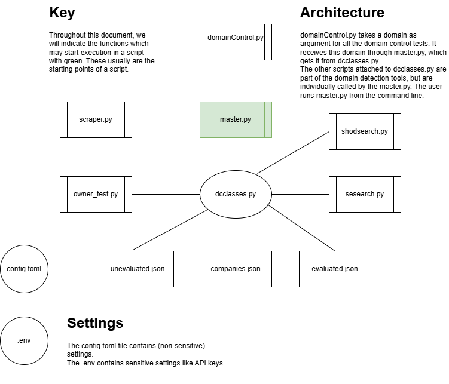
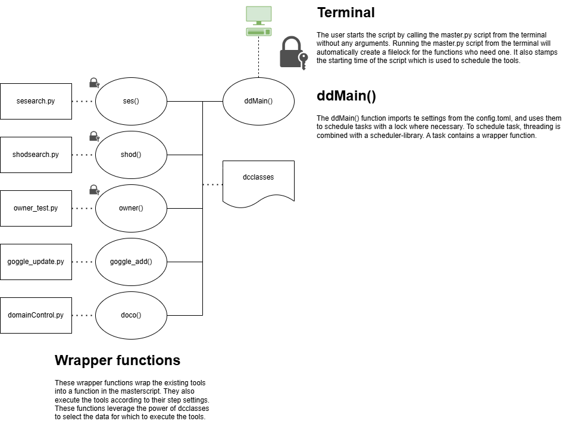
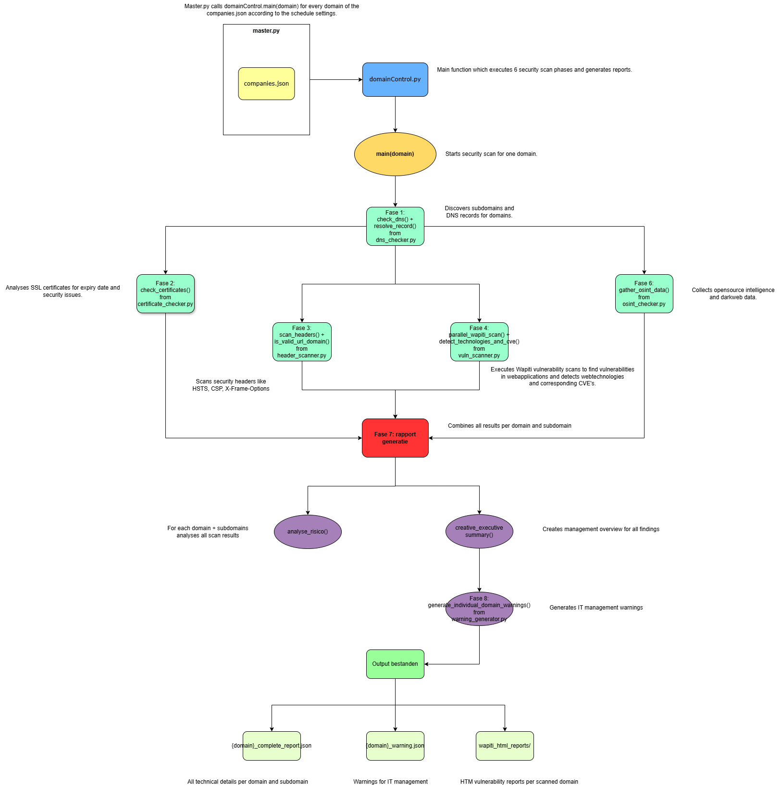
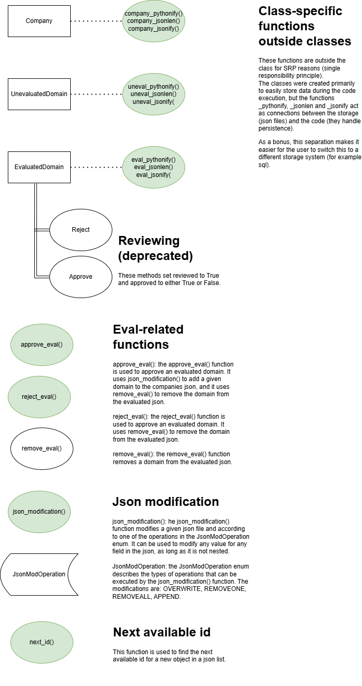
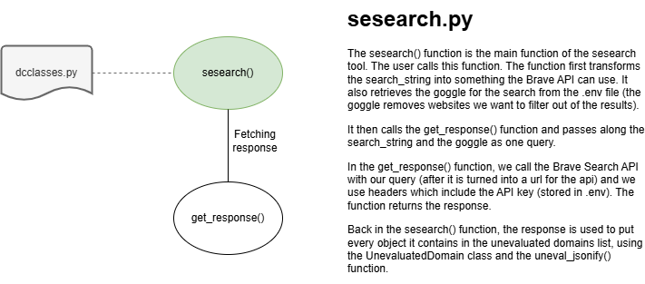
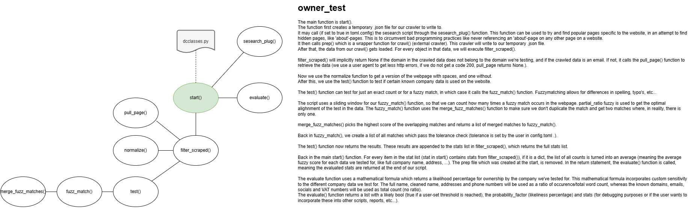
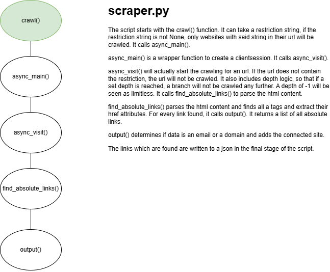
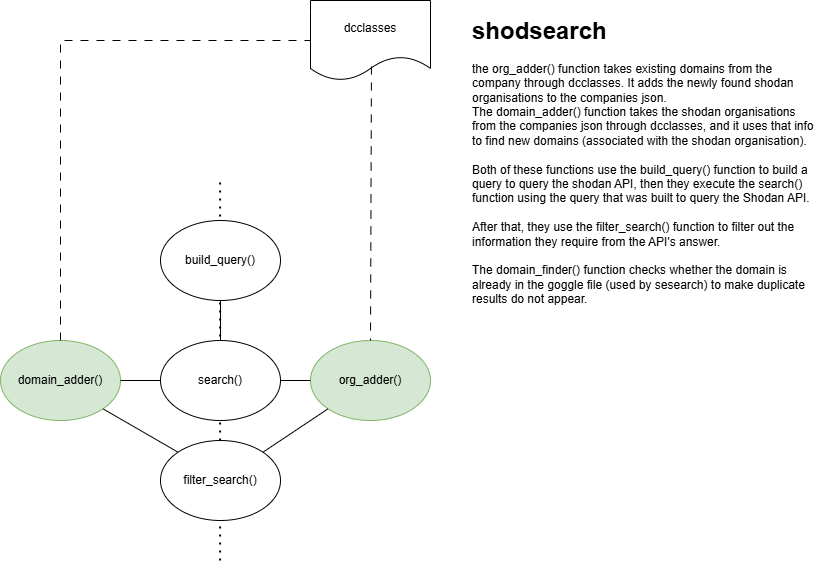
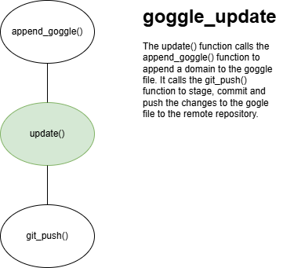

# Omma: Devguide


This document will teach you the inner workings of project Omma. You will learn what the provided code does, and how to implement your own code. We strongly encourage you to implement your own tools, together with project Omma, to have the experience tailored to your company/organisation's needs.
Getting started with project Omma? We recommend to follow the user manual in UserManual.MD to setup the project for the first time.
Need to tweak the settings of the project? You can find more information about this in the user manual in UserManual.MD.


##### Table of contents
1. [Disclaimers](#1-disclaimers)
2. [Adding your own components to project Omma](#2-adding-your-own-components-to-project-omma)
3. [Using the existing code](#3-using-the-existing-code)
    - 3.1 [domainDetection](#31-domaindetection)
        - 3.1.1 [dcclasses.py](#311-dcclassespy)
            - 3.1.1.1 [Company](#3111-company)
            - 3.1.1.2 [UnevaluatedDomain](#3112-unevaluateddomain)
            - 3.1.1.3 [EvaluatedDomain](#3113-evaluateddomain)
            - 3.1.1.4 [JsonModification](#3114-jsonmodification)
        - 3.1.2 [goggle_update.py](#312-goggle_updatepy)
        - 3.1.3 [owner_test.py](#313-owner_testpy)
        - 3.1.4 [scraper.py](#314-scraperpy)
        - 3.1.5 [sesearch.py](#315-sesearchpy)
        - 3.1.6 [shodsearch.py](#316-shodsearchpy)
    - 3.2 [domainControl](#32-domaincontrol)
        - 3.2.1 [domainControl.py](#321-domaincontrolpy)
        - 3.2.2 [dns_checker.py](#322-dns_checkerpy)
        - 3.2.3 [certificate_checker.py](#323-certificate_checkerpy)
        - 3.2.4 [header_scanner.py](#324-header_scannerpy)
        - 3.2.5 [vuln_scanner.py](#325-vuln_scannerpy)
        - 3.2.6 [osint_checker.py](#326-osint_checkerpy)
        - 3.2.7 [warning_generator.py](#327-warning_generatorpy)
        - 3.2.8 [utils.py](#328-utilspy)
4. [Inner workings of the code](#4-inner-workings-of-the-code)


## 1. Disclaimers
* We do not offer support for when things go wrong, be careful if you don't know what you're doing.
* We strongly recommend to keep project Omma's data separated from data used in other infrastructure. If you do want to connect project Omma to your own existing databases, we recommend to only read data from the existing databases.


## 2. Adding your own components to project Omma


To add your own components to project Omma, use the following steps. We strongly recommend you first read the rest of this guide before continuing with this section.  
1. Update configuration (config.toml)
    * You will need to add certain settings for your tools in the config.toml file.
    * Tool-specific settings can be put under a title like  
        ```
        [generalsection.specificsection]
        ```
    * The following variables must be present in this section:
        ```
        yourtool-frequency = number
        yourtool-step = number
        yourtool-start-minutes = number
        ```
2. Modify the master.py
    * Import your tool at the top of the script.
    * Global variables: add these global variables to the top of the script.
        ```
        yourtool_ini_exec = True
        yourtool_current_step = 0
        ```
        Do not set other values for these variables.
    * Wrapper function: add a wrapper function for your tool.  
        ```
        yourtool_wrapper(step, ini_exec=False, start_minutes=0):
        # read your data here
        if ini_exec:
            sleep(60 * start_minutes)
            global yourtool_ini_exec
        yourtool_ini_exec = False
        global yourtool_current_step
        global lock """if needed to protect files from data corruption.  (only necessary if a another script uses and edits the same data file)"""
        with lock: """if no lock is required, remove this and reduce indentation of the following code by 1"""
            print(f"{datetime.now()} yourtool {lock}") """remove {lock} if no lock is needed"""
            # loop through items based on yourtool_current_step and step
            # for an example, look at the existing code
                # within these loops, run yourmodule.yourfunction(data)
        yourtool_current_step += step (to remember the steps)
        ```
        This wrapper function essentially makes it possible to later schedule your tool using a scheduling library and threading.
    * Integrate in ddMain():
        * First read your configuration:
            ```
            yourtool_frequency = config["generalsection"]["specificsection"]["yourtool-frequency"]
            yourtool_step = config["generalsection"]["specificsection"]["yourtool-step"]
            yourtool_start_minutes = config["generalsection"]["specificsection"]["yourtool-start-minutes"]
            ```
        * Now add the initial execution:
            ```
            if yourtool_ini_exec:
                run_thread(yourtool_wrapper, (yourtool_step, True, yourtool_start_minutes))

            ```
            This will add the initial execution of the tool after the starting delay has passed.
        * Finally, schedule your tool to be run:
            ```
            if not yourtool_ini_exec:
                every(yourtool_frequency).minutes.do(run_thread, yourtool_wrapper, (yourtool_step))
            ```
            This code leverages the power of the schedule library to schedule the wrapper funcation, and thus everything that's executed from within the wrapper function, for every x minutes.
    * To summarize what we have done:
        In the config.toml file:
        * We added your settings to the config.toml.
        In the master.py script:
        * We imported your module (and its functions).
        * We setup the global variables required by the code to run.
        * We created a wrapper function to aid with the threading and scheduling of your tool.
        * We imported your settings into the ddMain() function.
        * We added the initial execution, the first execution of your tool, to be run x minutes after the master.py script was started.
        * We scheduled your tool to be run for infinity afterwards. (Infinity ends when the master.py script is interrupted, note that any errors in your tool will NOT stop the master.py script)


## 3. Using the existing code


### 3.1 domainDetection


#### 3.1.1 dcclasses.py


The dcclasses.py script wil function as a standardized way of reading and writing data to the json storages used by the domain detection.


##### 3.1.1.1 Company


The Company dataclass is a python class to create a company object which can be used for reading, writing and appending data to a company.
To create a company object, call Company() with the following parameters:  
* id: this is an int, used as a unique identifyer in the companies list. This value must be present and unique. Duplicated id's may result in unexpected behaviour.
* name: this is the name of your company, including abbreviations relating to your business structure (inc, ltd, ...). Please include the abbreviations. This value is a string and must be present.
* addresses: this is a list of addresses, representing the addresses of your company. If you do not have an address, please insert a unique string here as first value of the list to not confues the owner_test.
* phones: this a list of phone numbers, representing the phone numbers of your company. If you do not have a phone number, please insert a unique string here as first value of the list to not confues the owner_test.
* domains: this is a list of domains, representing the known domains of your company. Please insert at least one domain as the first value of the list.
* emails: this is a list of emails, representing the email addresses of your company. If you do not have an email address, please insert a unique string here as first value of the list to not confues the owner_test.
* socials: this is a list of strings, representing url's to social media pages of your company. If you do not have a social media url, please insert a unique string here as first value of the list to not confues the owner_test.
* vat_number: this is a string representing the VAT number, or an equivalent of your country. If you do not have a VAT number or a good equivalent, please insert a unique string here to not confues the owner_test.
* shodan_orgnames: these are the organisation names which are used in Shodan. This can be an empty list.


Related to the Company dataclass are the following functions:

company_pythonify(company_field, company_value, company_json_file):
* This function searches for a company in the provided company json file, and returns it as a python object.
* Use these arguments:
    * company_field: a string representing which field you search by in the json file. We recommend using the id-field.
    * company_value: a variable of any type which contains the data you search for by field in the json file.
    * company_json_file: a string representing the location of the json file in which to search for companies.

company_jsonlen(company_json_file):
* This function returns the length of the company json file.
* Use these arguments:
    * company_json_file: a string representing the location of the json file to measure the length of.

company_jsonify(company, company_json_file):
* This function puts a new company object in the json file.
* Use these arguments:
    * company: a python object of the class Company.
    * company_json_file: the location of the json file to put the new company in.


##### 3.1.1.2 UnevaluatedDomain


The UnevaluatedDomain dataclass is a python class to create an unevaluated domain object which can be used for reading, writing and appending data related to domains that have not yet been processed or evaluated.
To create an UnevaluatedDomain object, call UnevaluatedDomain() with the following parameters:
* id: this is an int, used as a unique identifier in the unevaluated domains list. This value must be present and unique.
* company_id: this is an int, representing the ID of the company to which this domain might belong. This value must be present.
* domain: this is a string, representing the domain name itself. This value must be present.


Related to the UnevaluatedDomain dataclass are the following functions:

uneval_pythonify(uneval_id, uneval_json_file):
* This function searches for an unevaluated domain in the provided JSON file by its ID and returns it as a python object.This function searches for an unevaluated domain in the provided JSON file by its ID and returns it as a python object.
* Use these arguments:
    * uneval_id: an int representing the ID of the unevaluated domain to search for.
    * uneval_json_file: a string representing the location of the JSON file in which to search for unevaluated domains.

uneval_jsonlen(uneval_json_file):
* This function returns the total number of unevaluated domain entries in the specified JSON file.
* Use these arguments:
    * uneval_json_file: a string representing the location of the JSON file to measure the length of.

uneval_jsonify(uneval, uneval_json_file):
* This function appends a new UnevaluatedDomain object to the specified JSON file.
* Use these arguments:
    * uneval: a python object of the class UnevaluatedDomain.
    * uneval_json_file: a string representing the location of the JSON file to append the new unevaluated domain to.


##### 3.1.1.3 EvaluatedDomain


The EvaluatedDomain dataclass is a python class to create an evaluated domain object, which stores information about a domain after it has been processed, including its likely ownership and review status.
To create an EvaluatedDomain object, call EvaluatedDomain() with the following parameters:
* id: this is an int, used as a unique identifier in the evaluated domains list. This value must be present and unique.
* company_id: this is a string, representing the ID of the company to which this domain is associated. This value must be present.
* domain: this is a string, representing the domain name itself. This value must be present.
* like_score: this is a float, representing a calculated score indicating the likelihood of the domain belonging to the company. This value must be present.
* owned: this is a boolean, set to True if the like_score passes a certain threshold, indicating probable ownership. This value must be present.
* stats: this is a list, containing statistics or other relevant data gathered during the evaluation of the domain. This can be an empty list.
* warning: this is a string, used to store any warnings or important notes generated during the domain evaluation. This can be an empty string.
Additionally, the object receives the following properties when created:
* reviewed: this is a bool, used to represent whether the domain has been reviewed by a human administrator. The default value is False.
* approved: this is a bool, used to represent whether the domain has been approved by a human administrator. The default value is False.
Additionally, the class has the following methods:
* approve(): sets reviewed to True and approved to True. This method only changes the data, and does not remove the domain from the evaluated json.
* reject(): sets reviewed to True and approved to False. This method only changes the data, and does not remove the domain from the evaluated json.

Related to the EvaluatedDomain dataclass are the following functions:
eval_pythonify(eval_id, eval_json_file):
* This function searches for an evaluated domain in the provided JSON file by its ID and returns it as a python object.
* Use these arguments:
    * eval_id: an int representing the ID of the evaluated domain to search for.
    * eval_json_file: a string representing the location of the JSON file in which to search for evaluated domains.

eval_jsonlen(eval_json_file):
* This function returns the total number of evaluated domain entries in the specified JSON file.
* Use these arguments:
    * eval_json_file: a string representing the location of the JSON file to measure the length of.

eval_jsonify(eval, eval_json_file):
* This function appends a new EvaluatedDomain object to the specified JSON file.
* Use these arguments:
    * eval: a python object of the class EvaluatedDomain.
    * eval_json_file: a string representing the location of the JSON file to append the new evaluated domain to.

approve_eval(eval_id, eval_file):
* This function handles the approval process for an evaluated domain. It retrieves the domain, marks it as approved, adds the domain to the corresponding company's domain list in the companies JSON file, and then removes the domain from the evaluated domains list.
* Use these arguments:
    * eval_id: an int representing the ID of the evaluated domain to approve.
    * eval_file: a string representing the location of the JSON file containing evaluated domains.

reject_eval(eval_id, eval_file):
* This function handles the rejection process for an evaluated domain. It retrieves the domain, marks it as rejected, and then removes the domain from the evaluated domains list.
* Use these arguments:
    * eval_id: an int representing the ID of the evaluated domain to reject.
    * eval_file: a string representing the location of the JSON file containing evaluated domains.

remove_eval(eval_id, eval_file):
* This function removes an evaluated domain entry from the specified JSON file based on its ID.
* Use these arguments:
    * eval_id: an int representing the ID of the evaluated domain to remove.
    * eval_file: a string representing the location of the JSON file from which to remove the domain.


##### 3.1.1.4 JsonModification


The JsonModification region provides an Enum defining types of JSON modification operations and a versatile function to perform these modifications on a JSON file.
The JsonModOperation Enum defines the available operations:
* OVERWRITE: Replaces the existing value of the target field with new data.
* REMOVEONE: Removes a specific item from a list in the target field.
* REMOVEALL: Clears all items from a list in the target field, or sets a string field to empty.
* APPEND: Adds new data to an existing list in the target field.

The JsonModification region has the following functions:

json_modification(json_file, key_field, key_value, change_field, change_operation: JsonModOperation, change_data):
* This function modifies a target JSON file. It searches for objects within the JSON file (expected to be a list of objects) where key_field matches key_value. For each matched object, it applies the change_operation to the change_field using change_data.
* Use these arguments:
    * json_file: a string representing the path to the JSON file to be modified.
    * key_field: a string representing the name of the field in JSON objects to check against key_value.
    * key_value: a variable (int, string, etc.) representing the value to match in the key_field.
    * change_field: a string representing the name of the field in the matched JSON object(s) that will be modified.
    * change_operation: an instance of the JsonModOperation Enum, specifying the type of modification to perform (e.g., JsonModOperation.APPEND).
    * change_data: the data to be used in the modification (e.g., the value to append, the new value for an overwrite). The type depends on the operation and the target field.

next_id(json_file): 
* This function calculates the next available sequential ID for a new entry in a given JSON file. It assumes items in the JSON file are a list of dictionaries, each having an "id" key. It finds the lowest missing non-negative integer ID.
* Use these arguments:
    * json_file: a string representing the location of the JSON file for which to find the next ID.


#### 3.1.2 goggle_update.py


The goggle_update script is used to automatically stage and commit changes in a local git repository, and push them to a remote git repository. To implement the script in your code, you can use the following functions:


append_goggle(domain, file_path):
* This function appends a discard instruction to the goggle.
* Use the following parameters:
    * domain: the domain which is to be discarded (ignored in results).
    * file_path: path of the goggle file.

git_push(repo_path, file_path, commit_message, remote_name, local_name):
* This function is used to automatically push changes to a remote github repository.
* Use the following parameters:
    * repo_path: the path of the local repository.
    * file_path: the file to be comitted and pushed.
    * commit_message: a commit message.
    * remote_name: the branch name of the remote repository, the default value is "origin".
    * local_name: the branch name of the local repository, the default value is "master".

update(domain):
* This function uses the previous functions to discard the domain and push the changes to the remote. It uses the config.toml file to get most parameters of these functions.
* Use the following parameters:
    * domain: the domain which is to be discarded by the goggle.


#### 3.1.3 owner_test.py


The owner_test script is used to determine whether a domain is owned by a specific company. Due to its' complexity, it is not possible to use every function in the script standalone.

initiate(uneval_id):
* This function is used to initiate the ownership test. Due to the complexity of the script, this function must take an unevaluated id. Using this id, it searches the unevaluated domains json file for the corresponding unevaluated domain. The script tests the domain for the company, specified by a company-id in the unevaluated json file.
* Use the following parameters:
    * uneval_id: the uniqe identifier 'id' for the object which is to be tested in the unevaluated json file.


#### 3.1.4 scraper.py


The scraper script is used by the owner_test script to get the webpages to be scanned. Due to the complexity and purpose of the script, it is not possible to use every function in the script standalone.

crawl(url, depth, restriction, json_path):
* This function is used to initiate the crawling/scraping. It retrieves all links and puts them in a json file.
* Use the following parameters:
    * url: the url for the website to be scraped.
    * depth: an int, indicates how deep the scraper goes.
    * restriction: used to restrict the scraper to one domain only (but multiple different paths and subdomains are still possible to be scanned.). This must equal the base url, for example: example.com, to function properly. If set to None, no restriction is used and the scraper may jump to any domain.
    * json_path: specifies the filepath to store the results.


#### 3.1.5 sesearch.py


The sesearch script is used to search for results as if you were using a search engine, but get structured answers through an API. Due to the complexity of the script, it is not possible to use every function in the script standalone.

sesearch(search_string, company_id, country, count, owner_test, prep_path):
* This function initiates the searching for new websites. It calls subsequent functions to complete the search.
* Use the following parameters:
    * search_string: the string of information which you want to search for.
    * company_id: the company_id to which the search string is related.
    * country: optional parameter to filter the results by country, default is ALL. Please refer to the official Brave Search documentation for the correct values.
    * count: optional parameter for the maximum amount of results to be sent, default is 20. The maximum limit is 20.
    * owner_test: a bool which indicates whether the search is part of owner_test. To save the results in a different location than specified in the toml (default toml setting is "unevaluated.json"), this must be set to true. Default value is false. The name owner_test remains for backwards compatibility with existing code, but the bool may be set to true for other scripts.
    * prep_path: if owner_test is set to true, this is where the results are stored. If owner_test is set to false, this will be ignored.


#### 3.1.6 shodsearch.py


The shodsearch script is used to search for organisation names connected with known domains, and unknown domains connected with said organisation names. The script has 2 functions which can be used standalone.

org_adder(company_id):
* This function adds shodan organisation-names to the companies json. It uses known domains and searches shodan for associated organisation names.
* Use the following parameter:
    * company_id: the company_id for the company for which you want to search new organisation names.

domain_finder(company_id):
* This function uses the known shodan organisation names to find new associated domains and hostnames. The results are written to the unevaluated json.
* Use the following parameter:
    * company_id: the company_id for the company for which you want to search new domains and hostnames.


### 3.2 domainControl


The domainControl component is a specialized security scanning engine that performs comprehensive security assessments on domains. It executes 8 distinct security phases to identify vulnerabilities, misconfigurations, and potential threats across the external attack surface.


#### 3.2.1 domainControl.py


The domainControl.py script serves as the main orchestrator for the security scanning process. It coordinates all scanning phases and manages the overall workflow.

**main(domain):**
* This function is the primary entry point for domain security scanning. It orchestrates all 8 security phases and manages the complete scanning workflow for a given domain.
* Use the following parameter:
    * domain: a string representing the domain to be scanned (e.g., "example.com").

**setup_directories():**
* This function creates the necessary directory structure for storing scan results. It ensures all required folders exist before scanning begins.
* No parameters required.

**load_config():**
* This function loads configuration settings from the config.toml file, including API keys, scanning parameters, and output preferences.
* Returns a configuration dictionary with all settings.

**execute_phase(phase_name, domain, config):**
* This function executes a specific scanning phase with proper error handling and logging.
* Use the following parameters:
    * phase_name: a string representing the name of the phase to execute.
    * domain: the target domain for scanning.
    * config: the configuration dictionary containing scan settings.

**generate_summary(domain, results):**
* This function creates a comprehensive summary report combining results from all scanning phases.
* Use the following parameters:
    * domain: the scanned domain name.
    * results: a dictionary containing results from all scanning phases.

**save_results(domain, phase, data):**
* This function saves phase-specific results to appropriate JSON files with proper formatting and timestamps.
* Use the following parameters:
    * domain: the target domain name.
    * phase: the scanning phase name.
    * data: the results data to be saved.


#### 3.2.2 dns_checker.py


The dns_checker script performs comprehensive DNS discovery and subdomain enumeration using multiple techniques including certificate transparency logs and DNS resolution.

**check_dns(domain):**
* This function is the main entry point for DNS discovery. It performs comprehensive subdomain enumeration and DNS analysis for the target domain.
* Use the following parameter:
    * domain: a string representing the target domain for DNS analysis.
* Returns a dictionary containing discovered subdomains, DNS records, and analysis results.

**query_crt_sh(domain):**
* This function queries the crt.sh certificate transparency database to discover subdomains through SSL certificate analysis.
* Use the following parameter:
    * domain: the target domain to search for in certificate logs.
* Returns a list of discovered subdomains from certificate transparency logs.

**resolve_subdomain(subdomain):**
* This function performs DNS resolution for a specific subdomain to verify its existence and gather DNS record information.
* Use the following parameter:
    * subdomain: the subdomain to resolve and analyze.
* Returns a dictionary containing DNS resolution results and record information.

**check_dns_security(domain):**
* This function analyzes DNS security configurations including DNSSEC, SPF, DMARC, and other security-related DNS records.
* Use the following parameter:
    * domain: the domain to analyze for DNS security configurations.
* Returns a dictionary containing DNS security analysis results.

**extract_subdomains(certificates):**
* This function extracts and processes subdomain information from certificate data, removing duplicates and invalid entries.
* Use the following parameter:
    * certificates: raw certificate data from transparency logs.
* Returns a cleaned list of unique subdomains.


#### 3.2.3 certificate_checker.py


The certificate_checker script analyzes SSL/TLS certificates for security issues, expiration dates, configuration problems, and certificate chain validation.

**check_certificates(subdomains):**
* This function is the main entry point for certificate analysis. It performs comprehensive SSL/TLS certificate security assessment across all discovered subdomains.
* Use the following parameter:
    * subdomains: a list of subdomains to analyze for certificate security.
* Returns a dictionary containing certificate analysis results for all subdomains.

**analyze_certificate(hostname):**
* This function performs detailed analysis of SSL/TLS certificates for a specific hostname, including chain validation and security assessment.
* Use the following parameter:
    * hostname: the hostname to analyze for certificate security.
* Returns a dictionary containing detailed certificate analysis results.

**check_certificate_expiry(cert):**
* This function checks certificate expiration dates and calculates days until expiry to identify certificates requiring renewal.
* Use the following parameter:
    * cert: the certificate object to analyze for expiration.
* Returns expiration analysis including days until expiry and renewal recommendations.

**validate_certificate_chain(hostname):**
* This function validates the complete certificate chain for proper configuration and trust relationships.
* Use the following parameter:
    * hostname: the hostname to validate certificate chain for.
* Returns chain validation results and any identified issues.

**check_certificate_security(cert):**
* This function analyzes certificate security configurations including key strength, signature algorithms, and security extensions.
* Use the following parameter:
    * cert: the certificate object to analyze for security configurations.
* Returns security analysis results and recommendations.

**get_certificate_info(hostname, port=443):**
* This function retrieves detailed certificate information from a specific hostname and port.
* Use the following parameters:
    * hostname: the target hostname to retrieve certificate from.
    * port: the port number to connect to (default is 443 for HTTPS).
* Returns detailed certificate information and metadata.


#### 3.2.4 header_scanner.py


The header_scanner script analyzes HTTP security headers to identify missing or misconfigured security controls that could expose the application to various attacks.

**scan_headers(subdomains):**
* This function is the main entry point for HTTP security header analysis. It performs comprehensive security header assessment across all discovered subdomains.
* Use the following parameter:
    * subdomains: a list of subdomains to analyze for HTTP security headers.
* Returns a dictionary containing security header analysis results for all subdomains.

**analyze_security_headers(url):**
* This function performs detailed analysis of HTTP security headers for a specific URL, checking for presence and proper configuration of security controls.
* Use the following parameter:
    * url: the URL to analyze for security headers.
* Returns a dictionary containing detailed security header analysis and recommendations.

**check_header_security(headers):**
* This function evaluates the security posture based on HTTP headers, identifying missing or misconfigured security controls.
* Use the following parameter:
    * headers: a dictionary of HTTP headers to analyze.
* Returns security assessment results and improvement recommendations.

**get_security_score(headers):**
* This function calculates a security score based on the presence and configuration of important security headers.
* Use the following parameter:
    * headers: the HTTP headers to evaluate for security scoring.
* Returns a numerical security score and detailed breakdown.

**check_specific_headers(headers):**
* This function checks for specific security headers and their proper configuration, including HSTS, CSP, X-Frame-Options, and others.
* Use the following parameter:
    * headers: the headers dictionary to check for specific security configurations.
* Returns analysis results for each specific security header.

**make_request(url, timeout=10):**
* This function makes HTTP requests to retrieve headers while handling various error conditions and timeouts.
* Use the following parameters:
    * url: the URL to make the request to.
    * timeout: request timeout in seconds (default is 10).
* Returns the HTTP response object or error information.


#### 3.2.5 vuln_scanner.py


The vuln_scanner script performs comprehensive vulnerability scanning using Wapiti and includes technology detection to identify the software stack and potential security issues.

**scan_vulnerabilities(subdomains):**
* This function is the main entry point for vulnerability scanning. It performs comprehensive security vulnerability assessment across all discovered subdomains using multiple scanning techniques.
* Use the following parameter:
    * subdomains: a list of subdomains to scan for vulnerabilities.
* Returns a dictionary containing vulnerability scan results for all subdomains.

**run_wapiti_scan(url):**
* This function executes Wapiti vulnerability scanner against a specific URL to identify web application security vulnerabilities.
* Use the following parameter:
    * url: the URL to scan for vulnerabilities using Wapiti.
* Returns Wapiti scan results including identified vulnerabilities and their severity levels.

**detect_technologies(url):**
* This function identifies the technology stack used by the web application, including web servers, frameworks, CMS, and other technologies.
* Use the following parameter:
    * url: the URL to analyze for technology detection.
* Returns a dictionary containing identified technologies and version information.

**parse_wapiti_results(wapiti_output):**
* This function parses and processes Wapiti scanner output to extract vulnerability information in a structured format.
* Use the following parameter:
    * wapiti_output: raw output from Wapiti scanner to parse.
* Returns structured vulnerability data with severity classifications.

**categorize_vulnerabilities(vulnerabilities):**
* This function categorizes identified vulnerabilities by type and severity to facilitate prioritization and remediation planning.
* Use the following parameter:
    * vulnerabilities: list of vulnerabilities to categorize.
* Returns categorized vulnerability data with risk assessments.

**check_common_vulnerabilities(url):**
* This function performs additional checks for common web application vulnerabilities not covered by automated scanners.
* Use the following parameter:
    * url: the URL to check for common vulnerabilities.
* Returns results of common vulnerability checks.


#### 3.2.6 osint_checker.py


The osint_checker script performs Open Source Intelligence (OSINT) gathering and dark web monitoring to identify potential security threats and data exposures.

**check_osint(domain):**
* This function is the main entry point for OSINT analysis. It performs comprehensive open source intelligence gathering and dark web monitoring for the target domain.
* Use the following parameter:
    * domain: the domain to analyze for OSINT and dark web intelligence.
* Returns a dictionary containing OSINT analysis results and threat intelligence.

**search_data_breaches(domain):**
* This function searches various data breach databases and sources to identify if the domain or associated email addresses have been involved in security incidents.
* Use the following parameter:
    * domain: the domain to search for in data breach databases.
* Returns information about identified data breaches and exposed information.

**monitor_dark_web(domain):**
* This function monitors dark web sources and forums for mentions of the target domain, potential threats, or compromised credentials.
* Use the following parameter:
    * domain: the domain to monitor on dark web sources.
* Returns dark web intelligence and potential threat indicators.

**check_social_media(domain):**
* This function searches social media platforms for mentions of the domain that could indicate security issues or reputation threats.
* Use the following parameter:
    * domain: the domain to search for on social media platforms.
* Returns social media intelligence and potential security-related mentions.

**gather_threat_intelligence(domain):**
* This function collects threat intelligence from various sources to identify potential threats targeting the domain.
* Use the following parameter:
    * domain: the domain to gather threat intelligence for.
* Returns comprehensive threat intelligence analysis.

**check_reputation(domain):**
* This function checks the domain's reputation across various security databases and blacklists.
* Use the following parameter:
    * domain: the domain to check reputation for.
* Returns reputation analysis and any identified security concerns.


#### 3.2.7 warning_generator.py


The warning_generator script creates executive-level security warnings and recommendations based on the comprehensive scan results from all security phases.

**generate_warnings(domain, scan_results):**
* This function is the main entry point for warning generation. It analyzes all scan results and creates prioritized security warnings and recommendations for executive reporting.
* Use the following parameters:
    * domain: the scanned domain name.
    * scan_results: comprehensive results from all scanning phases.
* Returns a dictionary containing prioritized warnings and executive recommendations.

**analyze_critical_issues(scan_results):**
* This function identifies and analyzes critical security issues that require immediate attention from the comprehensive scan results.
* Use the following parameter:
    * scan_results: results from all scanning phases to analyze for critical issues.
* Returns analysis of critical security issues requiring immediate action.

**generate_risk_assessment(scan_results):**
* This function creates a comprehensive risk assessment based on all identified security issues and their potential business impact.
* Use the following parameter:
    * scan_results: comprehensive scan results to assess for risk.
* Returns detailed risk assessment with business impact analysis.

**create_executive_summary(domain, warnings, risk_assessment):**
* This function creates an executive-level summary suitable for management reporting, focusing on business impact and recommended actions.
* Use the following parameters:
    * domain: the scanned domain name.
    * warnings: generated security warnings.
    * risk_assessment: comprehensive risk assessment results.
* Returns executive summary with actionable recommendations.

**prioritize_recommendations(warnings):**
* This function prioritizes security recommendations based on risk level, business impact, and implementation complexity.
* Use the following parameter:
    * warnings: security warnings to prioritize.
* Returns prioritized list of security recommendations.

**format_warnings(warnings):**
* This function formats security warnings for different audiences (technical teams, management, executives) with appropriate detail levels.
* Use the following parameter:
    * warnings: raw security warnings to format.
* Returns formatted warnings suitable for different stakeholder groups.


#### 3.2.8 utils.py


The utils script provides utility functions used by other domainControl components, including redirect detection and common helper functions.

**detect_redirects(url):**
* This function detects and analyzes HTTP redirects to identify redirect chains and potential security issues related to URL redirection.
* Use the following parameter:
    * url: the URL to analyze for redirects.
* Returns redirect analysis including redirect chains and security implications.

**follow_redirect_chain(url, max_redirects=10):**
* This function follows HTTP redirect chains to their final destination while tracking all intermediate redirects.
* Use the following parameters:
    * url: the starting URL to follow redirects from.
    * max_redirects: maximum number of redirects to follow (default is 10).
* Returns complete redirect chain analysis and final destination.

**validate_url(url):**
* This function validates URL format and accessibility to ensure proper URL handling throughout the scanning process.
* Use the following parameter:
    * url: the URL to validate.
* Returns validation results and any identified URL issues.

**normalize_domain(domain):**
* This function normalizes domain names to ensure consistent formatting and handling throughout the scanning process.
* Use the following parameter:
    * domain: the domain name to normalize.
* Returns normalized domain name in standard format.

**extract_domain_from_url(url):**
* This function extracts the domain name from a complete URL for domain-specific processing.
* Use the following parameter:
    * url: the URL to extract domain from.
* Returns the extracted domain name.

**check_url_accessibility(url, timeout=10):**
* This function checks if a URL is accessible and responds properly to HTTP requests.
* Use the following parameters:
    * url: the URL to check for accessibility.
    * timeout: request timeout in seconds (default is 10).
* Returns accessibility status and response information.


## 4. Inner workings of the code


This section will go over the inner workings of the code. To setup the project, you do not necessarily need to know this information, but we advise you to read this in order to be able to properly debug the project. The diagrams can also be viewed as html (see: asm_architecture.drawio.html).

  
  
  
  
  
  
  
  
  

